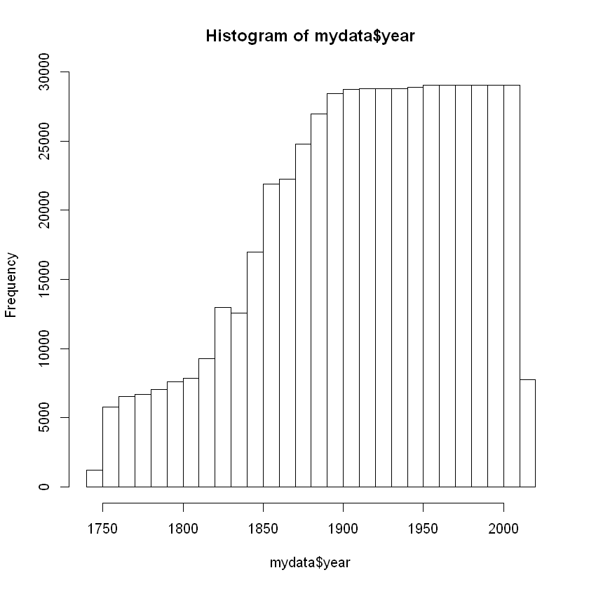
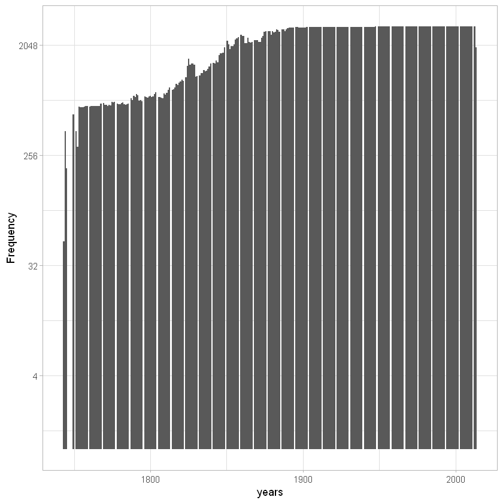
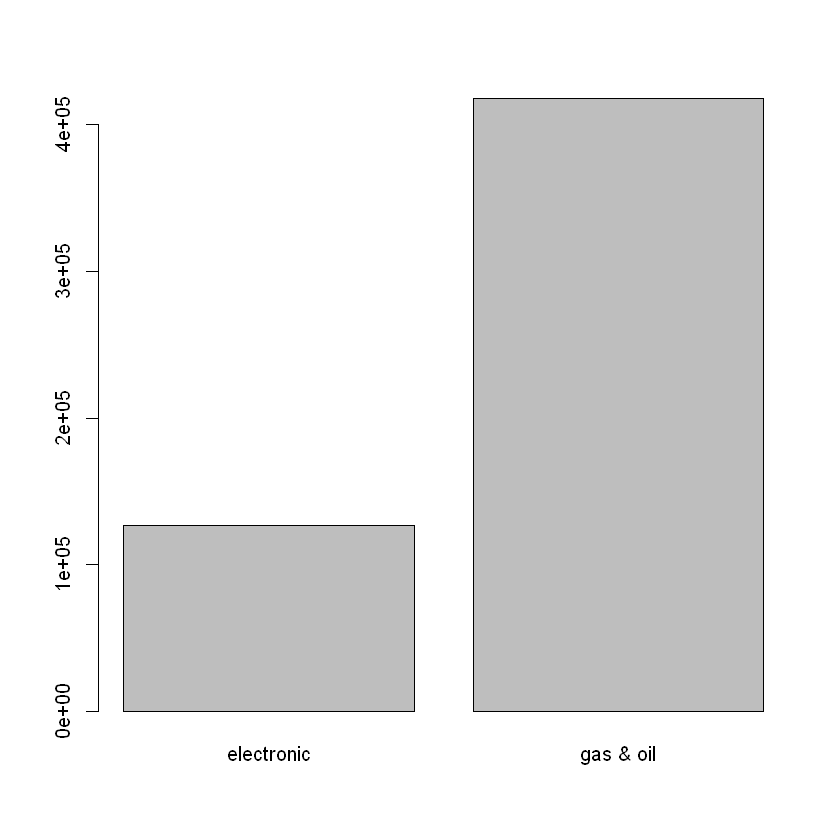
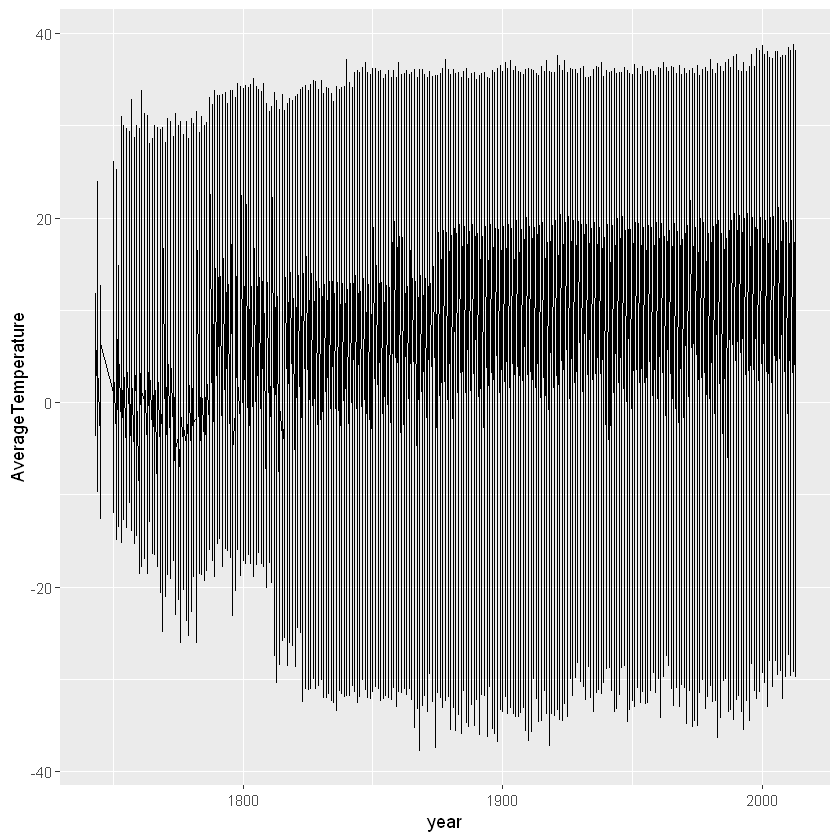
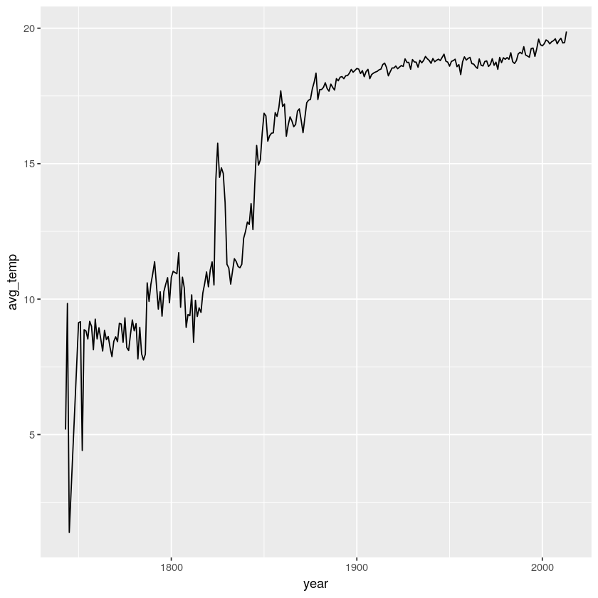

# Descriptive Statistics


### Descriptive stat with basic summary function


```R
summary(mydata)
```


              dt         AverageTemperature AverageTemperatureUncertainty
     1948-02-01:   242   Min.   :-37.66     Min.   : 0.052               
     1948-03-01:   242   1st Qu.: 10.03     1st Qu.: 0.323               
     1948-04-01:   242   Median : 20.90     Median : 0.571               
     1948-05-01:   242   Mean   : 17.19     Mean   : 1.019               
     1948-06-01:   242   3rd Qu.: 25.81     3rd Qu.: 1.207               
     1948-07-01:   242   Max.   : 38.84     Max.   :15.003               
     (Other)   :543359                                                   
        Country            year          era           
     Ã…land :  3166   Min.   :1743   Length:544811     
     Albania:  3166   1st Qu.:1869   Class :character  
     Andorra:  3166   Median :1919   Mode  :character  
     Austria:  3166   Mean   :1913                     
     Belarus:  3166   3rd Qu.:1966                     
     Belgium:  3166   Max.   :2013                     
     (Other):525815                                    


***

### Descriptive statistics with visualization 

#### Create histogram for “year” 


```R
hist(mydata$year)
```





#### Create a histogram using gpplot 2

* ggplot(mydata, aes(x=year)) creates a plot using `mydata` aes defines the `x`, `y` and many other axis
* geom_histogram defines de plot as a histogram, `binwidth` defines de width of the bars
* scale_y_continuous(trans='log2') transforms the scale of the graph to `log2` delete `+ scale_y_continuous(trans='log2')` and check what happens
* theme_light() changes the theme. There are various themes like black and white or color blind. 
* labs(x="years", y="Frequency", face="bold") changes the `x` and `y` labels in the plot


```R
g <- ggplot(mydata, aes(x=year)) + geom_histogram(binwidth=.9) + scale_y_continuous(trans='log2')
g <- g + theme_light() + labs(x="years", y="Frequency", face="bold")
g
```

    Warning message:
    "Transformation introduced infinite values in continuous y-axis"
    Warning message:
    "Removed 34 rows containing missing values (geom_bar)."
    





***

#### Create histogram for “Countries” 


```R
barplot(table(mydata$era))
```





***

### More visualization functions with “ggplot2”

Try to run this command:

```
ggplot(data=mydata, aes(x=year, y=AverageTemperature)) + geom_line()
```


```R
ggplot(data=mydata, aes(x=year, y=AverageTemperature)) + geom_line()
```





### Can we do better? 

What if we can create smaller data with the year and the average temperature of that year?


```R
grouped_data <- mydata  %>%
    group_by(year) %>%
    summarise(avg_temp = mean(AverageTemperature))
```


```R
head(grouped_data)
```


<table>
<caption>A tibble: 6 × 2</caption>
<thead>
	<tr><th scope="col">year</th><th scope="col">avg_temp</th></tr>
	<tr><th scope="col">&lt;dbl&gt;</th><th scope="col">&lt;dbl&gt;</th></tr>
</thead>
<tbody>
	<tr><td>1743</td><td>5.184140</td></tr>
	<tr><td>1744</td><td>9.837898</td></tr>
	<tr><td>1745</td><td>1.387125</td></tr>
	<tr><td>1750</td><td>9.129353</td></tr>
	<tr><td>1751</td><td>9.167388</td></tr>
	<tr><td>1752</td><td>4.413387</td></tr>
</tbody>
</table>


```R
ggplot(data=grouped_data, aes(x=year, y=avg_temp)) +
  geom_line()
```





# Exercise

## If we are on track, try to:


### 1. load carbon dioxide data

### 2. remove NA

### 3. Change column "CarbonDioxide" to numeric

### 4. Change column "year" to numeric

### view the data using the head( )  and tail( ) commands


<br><br><br><br>


## Don't spoil the fun. The stick figure is watching you


<br><br><br><br>


### Answer:


```R
carbon <- read.csv("CarbonDioxideEmission.csv")
```


```R
carbon <- na.omit(carbon)

carbon$CarbonDioxide <- as.numeric(carbon$CarbonDioxide)
carbon$year <- as.numeric(carbon$year)

head(carbon)
tail(carbon)
```


<table>
<caption>A data.frame: 6 × 7</caption>
<thead>
	<tr><th></th><th scope="col">year</th><th scope="col">Month</th><th scope="col">DecimalDate</th><th scope="col">CarbonDioxide</th><th scope="col">SeasonallyAdjustedCO2</th><th scope="col">CarbonDioxideFit</th><th scope="col">SeasonallyAdjustedCO2Fit</th></tr>
	<tr><th></th><th scope="col">&lt;dbl&gt;</th><th scope="col">&lt;int&gt;</th><th scope="col">&lt;dbl&gt;</th><th scope="col">&lt;dbl&gt;</th><th scope="col">&lt;dbl&gt;</th><th scope="col">&lt;dbl&gt;</th><th scope="col">&lt;dbl&gt;</th></tr>
</thead>
<tbody>
	<tr><th scope="row">3</th><td>1958</td><td>3</td><td>1958.203</td><td>315.69</td><td>314.42</td><td>316.18</td><td>314.89</td></tr>
	<tr><th scope="row">4</th><td>1958</td><td>4</td><td>1958.288</td><td>317.45</td><td>315.15</td><td>317.30</td><td>314.98</td></tr>
	<tr><th scope="row">5</th><td>1958</td><td>5</td><td>1958.370</td><td>317.50</td><td>314.73</td><td>317.83</td><td>315.06</td></tr>
	<tr><th scope="row">7</th><td>1958</td><td>7</td><td>1958.537</td><td>315.86</td><td>315.17</td><td>315.87</td><td>315.21</td></tr>
	<tr><th scope="row">8</th><td>1958</td><td>8</td><td>1958.622</td><td>314.93</td><td>316.17</td><td>314.01</td><td>315.29</td></tr>
	<tr><th scope="row">9</th><td>1958</td><td>9</td><td>1958.707</td><td>313.21</td><td>316.06</td><td>312.48</td><td>315.35</td></tr>
</tbody>
</table>


<table>
<caption>A data.frame: 6 × 7</caption>
<thead>
	<tr><th></th><th scope="col">year</th><th scope="col">Month</th><th scope="col">DecimalDate</th><th scope="col">CarbonDioxide</th><th scope="col">SeasonallyAdjustedCO2</th><th scope="col">CarbonDioxideFit</th><th scope="col">SeasonallyAdjustedCO2Fit</th></tr>
	<tr><th></th><th scope="col">&lt;dbl&gt;</th><th scope="col">&lt;int&gt;</th><th scope="col">&lt;dbl&gt;</th><th scope="col">&lt;dbl&gt;</th><th scope="col">&lt;dbl&gt;</th><th scope="col">&lt;dbl&gt;</th><th scope="col">&lt;dbl&gt;</th></tr>
</thead>
<tbody>
	<tr><th scope="row">704</th><td>2016</td><td> 8</td><td>2016.623</td><td>402.24</td><td>403.78</td><td>403.02</td><td>404.60</td></tr>
	<tr><th scope="row">705</th><td>2016</td><td> 9</td><td>2016.708</td><td>401.01</td><td>404.52</td><td>401.33</td><td>404.85</td></tr>
	<tr><th scope="row">706</th><td>2016</td><td>10</td><td>2016.790</td><td>401.50</td><td>405.12</td><td>401.48</td><td>405.09</td></tr>
	<tr><th scope="row">707</th><td>2016</td><td>11</td><td>2016.874</td><td>403.64</td><td>405.92</td><td>403.08</td><td>405.34</td></tr>
	<tr><th scope="row">708</th><td>2016</td><td>12</td><td>2016.956</td><td>404.55</td><td>405.49</td><td>404.66</td><td>405.58</td></tr>
	<tr><th scope="row">709</th><td>2017</td><td> 1</td><td>2017.041</td><td>406.07</td><td>406.04</td><td>405.87</td><td>405.83</td></tr>
</tbody>
</table>
