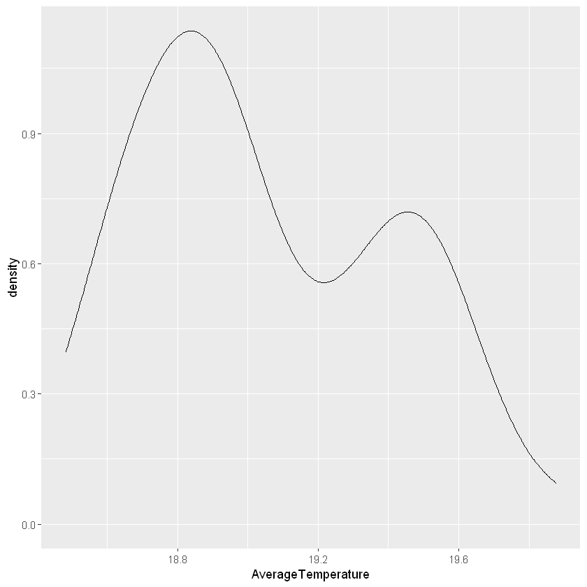

# Inference Statistics


## Some housekeeping and background

### Copy & run the code below 


```R
carbon <- group_by(carbon, year) %>%
    summarise(AverageCarbonEmission = mean(CarbonDioxide))

newdata <- group_by(mydata, year, era) %>%
    summarise(AverageTemperature = mean(AverageTemperature))

carbon <- merge(newdata, carbon[, c("year", "AverageCarbonEmission")], by="year")
head(carbon)
```


<table>
<caption>A data.frame: 6 × 4</caption>
<thead>
	<tr><th></th><th scope="col">year</th><th scope="col">era</th><th scope="col">AverageTemperature</th><th scope="col">AverageCarbonEmission</th></tr>
	<tr><th></th><th scope="col">&lt;dbl&gt;</th><th scope="col">&lt;chr&gt;</th><th scope="col">&lt;dbl&gt;</th><th scope="col">&lt;dbl&gt;</th></tr>
</thead>
<tbody>
	<tr><th scope="row">1</th><td>1958</td><td>gas &amp; oil</td><td>18.94217</td><td>315.3300</td></tr>
	<tr><th scope="row">2</th><td>1959</td><td>gas &amp; oil</td><td>18.82521</td><td>315.9817</td></tr>
	<tr><th scope="row">3</th><td>1960</td><td>gas &amp; oil</td><td>18.88701</td><td>316.9083</td></tr>
	<tr><th scope="row">4</th><td>1961</td><td>gas &amp; oil</td><td>18.92357</td><td>317.6450</td></tr>
	<tr><th scope="row">5</th><td>1962</td><td>gas &amp; oil</td><td>18.69385</td><td>318.4533</td></tr>
	<tr><th scope="row">6</th><td>1963</td><td>gas &amp; oil</td><td>18.67525</td><td>318.9925</td></tr>
</tbody>
</table>


### You may want to review this code at home, but for now let's just consider that it merges two datasets

A detailed explanation for later reference explained line-by-line:

1. the `carbon` data will be updated with the result of the right-hand operation. The right-hand operation groups the dataset by year


2. after grouping, we apply the `summarise` to create a column named `carbon` the value of the column is the `mean` of the `CarbonDioxide` emission


3. we do a similar grouping operation creating a `newdata` data. 


4. this time, we are interested in the mean of the `AverageTemperature`


5. we now have two variables, one with the `year` and `AverageCarbonEmission` and another with year and `AverageTemperature`. Let's `merge` these two tables in a final `carbon` table. Our merging criteria is the `year` and we will copy two columns from the initial carbon table: `c("year", "AverageCarbonEmission")`

<br>

### Hypothesis testing

From [Wikipedia](https://en.wikipedia.org/wiki/Statistical_significance):

#### To determine whether a result is statistically significant, a researcher calculates a p-value, which is the probability of observing an effect of the same magnitude or more extreme given that the null hypothesis is true.

#### The null hypothesis is rejected if the p-value is less than a predetermined level, α.

#### α is called the significance level, and is the probability of rejecting the null hypothesis given that it is true (a type I error). 

#### α is usually set at or below 5%.


## Our null hypotheses

### There is no difference in the Average temperature in the `gas & oil` era and the `electronic` era


```R
head(mydata)
```


<table>
<caption>A data.frame: 6 × 6</caption>
<thead>
	<tr><th></th><th scope="col">dt</th><th scope="col">AverageTemperature</th><th scope="col">AverageTemperatureUncertainty</th><th scope="col">Country</th><th scope="col">year</th><th scope="col">era</th></tr>
	<tr><th></th><th scope="col">&lt;fct&gt;</th><th scope="col">&lt;dbl&gt;</th><th scope="col">&lt;dbl&gt;</th><th scope="col">&lt;fct&gt;</th><th scope="col">&lt;dbl&gt;</th><th scope="col">&lt;chr&gt;</th></tr>
</thead>
<tbody>
	<tr><th scope="row">1</th><td>1743-11-01</td><td> 4.384</td><td>2.294</td><td>Ã…land</td><td>1743</td><td>gas &amp; oil</td></tr>
	<tr><th scope="row">2</th><td>1744-04-01</td><td> 1.530</td><td>4.680</td><td>Ã…land</td><td>1744</td><td>gas &amp; oil</td></tr>
	<tr><th scope="row">3</th><td>1744-05-01</td><td> 6.702</td><td>1.789</td><td>Ã…land</td><td>1744</td><td>gas &amp; oil</td></tr>
	<tr><th scope="row">4</th><td>1744-06-01</td><td>11.609</td><td>1.577</td><td>Ã…land</td><td>1744</td><td>gas &amp; oil</td></tr>
	<tr><th scope="row">5</th><td>1744-07-01</td><td>15.342</td><td>1.410</td><td>Ã…land</td><td>1744</td><td>gas &amp; oil</td></tr>
	<tr><th scope="row">6</th><td>1744-09-01</td><td>11.702</td><td>1.517</td><td>Ã…land</td><td>1744</td><td>gas &amp; oil</td></tr>
</tbody>
</table>


#### Independent T-test compares means between two groups

It is often used to see whether there is a group difference in continuous data **between two groups** 

*Model assumptions*

    (1) Independence

    (2) Normality

    (3) Equal variance


```R
t.test(AverageTemperature ~ era, data=carbon, var.eq=TRUE)
```


    
    	Two Sample t-test
    
    data:  AverageTemperature by era
    t = 3.7437, df = 54, p-value = 0.0004415
    alternative hypothesis: true difference in means is not equal to 0
    95 percent confidence interval:
     0.1806106 0.5970976
    sample estimates:
    mean in group electronic  mean in group gas & oil 
                    19.13249                 18.74364 
    


Interpreting the results:

* `t` value guides our analysis. Read more at this [link](https://blog.minitab.com/blog/adventures-in-statistics-2/understanding-t-tests-t-values-and-t-distributions)
* `df = 54` degrees of freedom 
* `p-value < 0.0004415` pretty low, so that means that we can reject the null hypothesis

<br>

* Which one seems higher?
    * mean in group `gas & oil` = `18.74364`
    * mean in group `eletronics` = `19.13249`


### Is there any association between the `AverageTemperature` and the `AverageCarbonEmission`  ?

#### Pearson’s correlation is used to examine associations between variables (represented by continuous data) by looking at the direction and strength of the associations


```R
cor.test(carbon$AverageTemperature, carbon$AverageCarbonEmission, method="pearson")
```


    
    	Pearson's product-moment correlation
    
    data:  carbon$AverageTemperature and carbon$AverageCarbonEmission
    t = 14.919, df = 54, p-value < 2.2e-16
    alternative hypothesis: true correlation is not equal to 0
    95 percent confidence interval:
     0.8299122 0.9386169
    sample estimates:
          cor 
    0.8970832 
    


Interpreting the results:

* `p-value < 2.2e-16` pretty low, so that means that there is statistically significant correlation between `temperature` and `carbon emission`

<br>

* How strong is the correlation  `cor` = `0.8970832` 

    Interpretation varies by research field so results should be interpreted with caution
    
    `cor` varies from `-1` to `1` positive values indicate that an increase in the `x` variable increases the `y` variable. In this case, a value closer to `1` means a strong positive correlation


***

### Did we do the correct analysis?

### What if the data is not normally distributed?

#### Let us test for normality using the Shapiro-Wilk test:

**Null hypothesis**: The data is normally distributed. If p > 0.05, normality can be assumed.


```R
shapiro.test(carbon$AverageTemperature)
```


    
    	Shapiro-Wilk normality test
    
    data:  carbon$AverageTemperature
    W = 0.94052, p-value = 0.008176
    


* `p-value < 0.05` So we reject the null hypothesis and our data is skewed 

#### We can also check data visually 


```R
ggplot(carbon, aes(x=AverageTemperature)) + 
  geom_density()
```





***

### So what tests should we run?


Parametric test | R | Non-parametric test | R
--- | --- | --- | ---
Independent t-test | `t.test(y~x)` |  Mann-Whitney test | `wilcox.test(y~x)`
Paired t-test | `t.test(y1, y2, paired=TRUE)` | Wilcoxon signed rank test | `wilcox.test(y1,y2,paired=TRUE)`
One-way ANOVA | `aov(y ~ x, data = my_data)` |  Kruskal-Wallis test | `kruskal.test(y~x)`
Pearson's correlation | `cor.test(x, y, method=c("pearson")` | Spearman's correlation | `cor.test(x, y, method=c("spearman")`

These are only some examples

***

# Exercise

## If we are on track, try to:


### 1. Run the proper non-parametric tests for our data/analysis


<br><br><br><br>


## Don't spoil the fun. The stick figure is watching you


<br><br><br><br>


***

### Answer:


### Mann-Whitney test


```R
wilcox.test(AverageTemperature ~ era, data=carbon)
```


    
    	Wilcoxon rank sum test
    
    data:  AverageTemperature by era
    W = 437, p-value = 0.0002986
    alternative hypothesis: true location shift is not equal to 0
    


***

### Spearman Correlation


```R
cor.test(carbon$AverageTemperature, carbon$AverageCarbonEmission, method="spearman")
```


    
    	Spearman's rank correlation rho
    
    data:  carbon$AverageTemperature and carbon$AverageCarbonEmission
    S = 4452, p-value < 2.2e-16
    alternative hypothesis: true rho is not equal to 0
    sample estimates:
          rho 
    0.8478469 
    


***

### Conclusions from our analysis


***